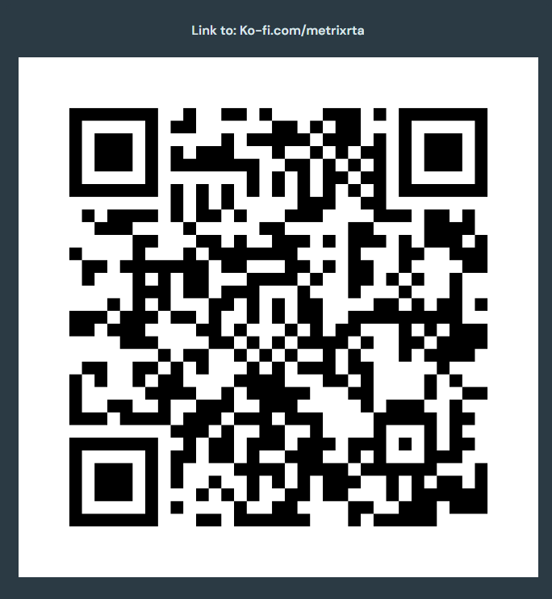
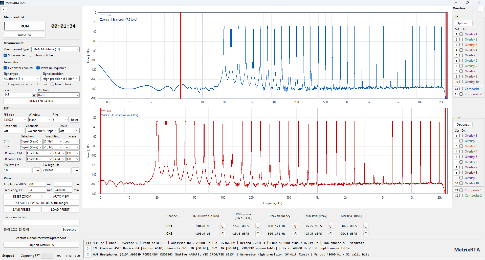
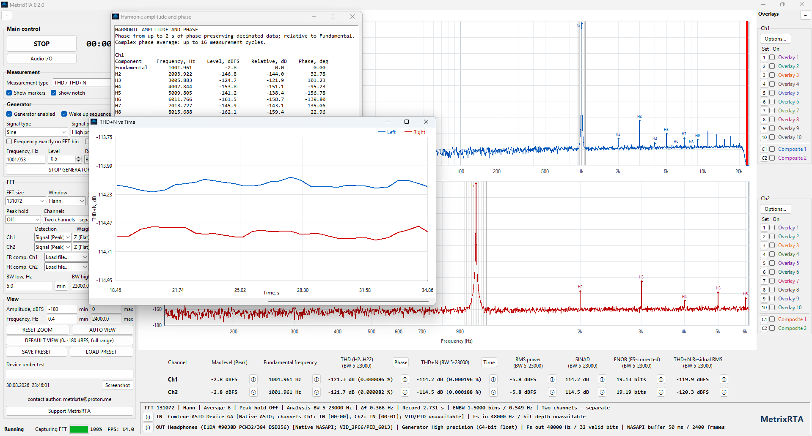
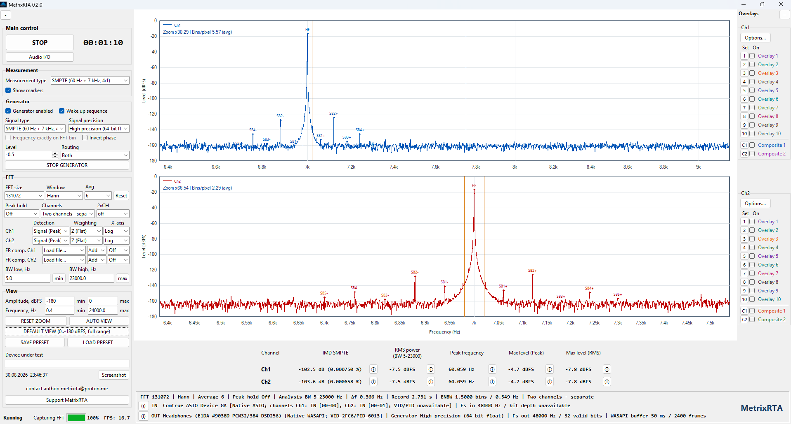
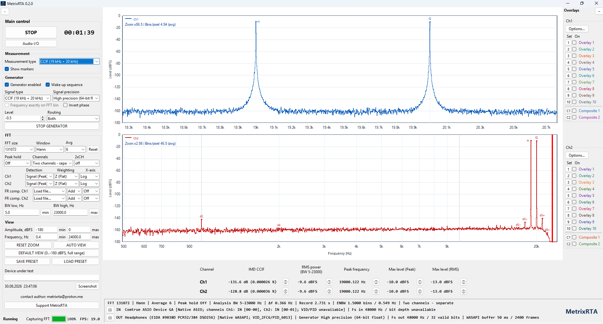

# MetrixRTA

Real-time audio spectrum and distortion analyzer for Windows.

MetrixRTA is a Windows application for real-time FFT spectrum analysis and audio measurement.

> **Current pre-release:** 0.2.0

## Features

- Real-time FFT spectrum analysis
- THD / THD+N measurement
- THD+N vs time
- CCIF IMD measurement
- SMPTE IMD measurement
- TD+N Multitone measurement
- WASAPI and ASIO support
- ASIO and WASAPI support up to 768 kHz with compatible hardware
- Two-channel analysis
- Spectrum averaging and overlays

## Download

### [Download MetrixRTA 0.2.0 x64](https://github.com/MetrixRTA/MetrixRTA/releases/download/v0.2.0/MetrixRTA_0.2.0_x64.exe)

This version is published as a pre-release. The complete release page is available in the [Releases](https://github.com/MetrixRTA/MetrixRTA/releases/tag/v0.2.0) section of this repository.

This repository contains documentation and binary releases only.

The application source code is not published.

## Metrix RTA Probe

Need to check which sample rates, formats and buffer sizes an audio driver actually supports?

[Open Metrix RTA Probe](https://github.com/MetrixRTA/Metrix-RTA-Probe) · [Download version 0.1.3 x64](https://github.com/MetrixRTA/Metrix-RTA-Probe/releases/download/0.1.3/MetrixRTAProbe_0.1.3_x64.exe)

## System requirements

- Windows 10 / Windows 11
- x64 system
- WASAPI or ASIO compatible audio device

## File verification

A SHA-256 checksum is published for each release.

To verify a downloaded file in Windows:

~~~cmd
certutil -hashfile MetrixRTA.exe SHA256
~~~

Compare the resulting SHA-256 hash with the checksum published on the corresponding GitHub release page.

## Security

Official MetrixRTA releases are distributed through this GitHub repository.

You can additionally scan the downloaded file with Microsoft Defender, VirusTotal, or another antivirus service before running it.

## Support MetrixRTA

MetrixRTA is free to use.

If you find it useful, you can optionally support its continued development.

Donations are completely voluntary and do not unlock any additional features.

### [Support MetrixRTA on Ko-fi](https://ko-fi.com/metrixrta)

## Screenshots

## License

MetrixRTA is distributed as closed-source software.

All rights reserved.
