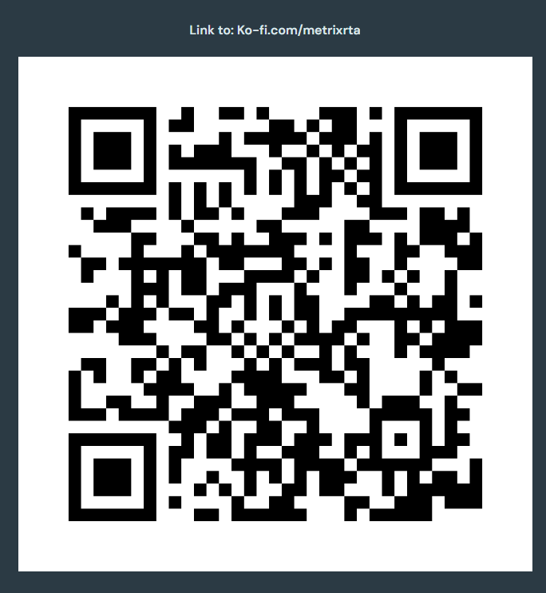
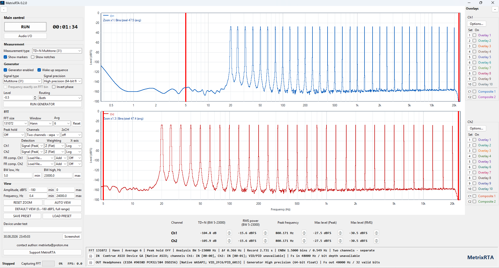
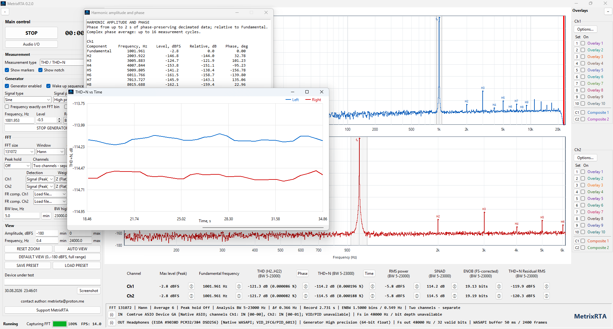
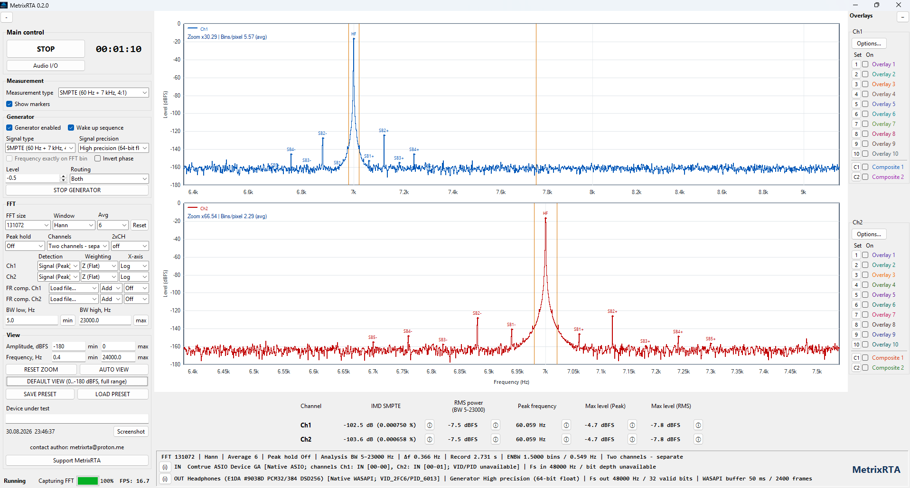
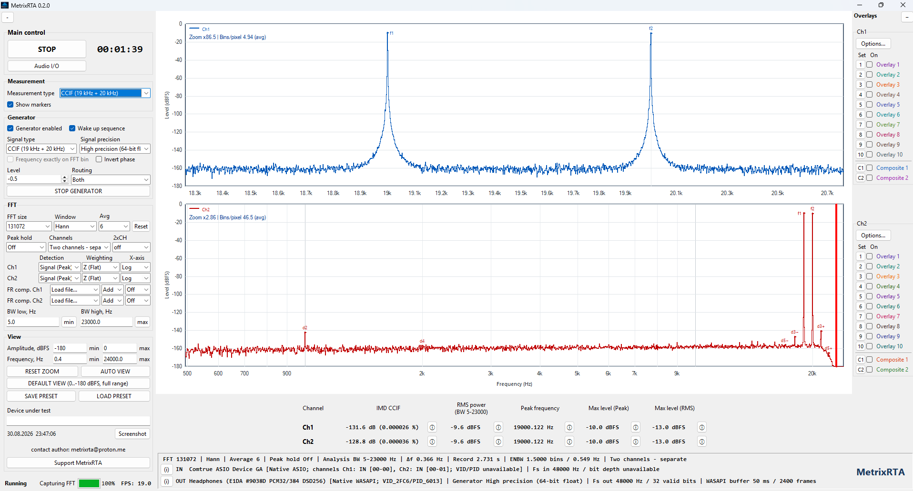

# MetrixRTA

Real-time audio spectrum and distortion analyzer for Windows.

MetrixRTA is a FREE Windows application for real-time FFT spectrum analysis and audio measurement.

> **Current pre-release:** [0.3.0](https://github.com/MetrixRTA/MetrixRTA/releases/tag/v0.3.0)

## Features

Key features:
• Real-time FFT analysis with FFT sizes up to 8M points, linear and logarithmic frequency scales, averaging, Peak Hold, and multiple FFT window functions.
• Support for sample rates up to 768 kHz.
• THD, THD+N, and THD/THD+N vs Frequency measurements.
• IMD CCIF and SMPTE, DIM30 and DIM100.
• Multitone TDN and AM Level measurements.
• AM and PM noise analysis.
• Waveform mode for time-domain signal analysis, including simultaneous display of the input signal and residual during distortion measurements.
• Spectrum and Noise Density display modes.
• Measurement Details with a detailed breakdown of measurement results, including the formulas used, intermediate values, and substitution of actual measured values directly into the formulas.
• Built-in test signal generator and Digital Loopback mode.
• Independent input and output audio interface selection, including native WASAPI Exclusive and ASIO.
• Interactive plot scaling and configuration, with day and night display modes.

## Download

The complete release page is available in the 

### [Releases](https://github.com/MetrixRTA/MetrixRTA/releases) 

section of this repository.

This repository contains documentation and binary releases only.

The application source code is not published.

## System requirements

- Windows 10 / Windows 11
- x64 system
- WASAPI or ASIO compatible audio device

## File verification

A SHA-256 checksum is published for each release.

To verify a downloaded file in Windows:

~~~cmd
certutil -hashfile MetrixRTA.exe SHA256
~~~

Compare the resulting SHA-256 hash with the checksum published on the corresponding GitHub release page.

## Security

Official MetrixRTA releases are distributed through this GitHub repository.

You can additionally scan the downloaded file with Microsoft Defender, VirusTotal, or another antivirus service before running it.

## Support MetrixRTA

MetrixRTA is free to use.

If you find it useful, you can optionally support its continued development.

Tips are completely voluntary and do not unlock any additional features.

### [Support MetrixRTA on Ko-fi](https://ko-fi.com/metrixrta)

### [Support MetrixRTA on Boosty](https://boosty.to/truerta/donate)

## Screenshots

## License

MetrixRTA is distributed as closed-source software.

All rights reserved.
